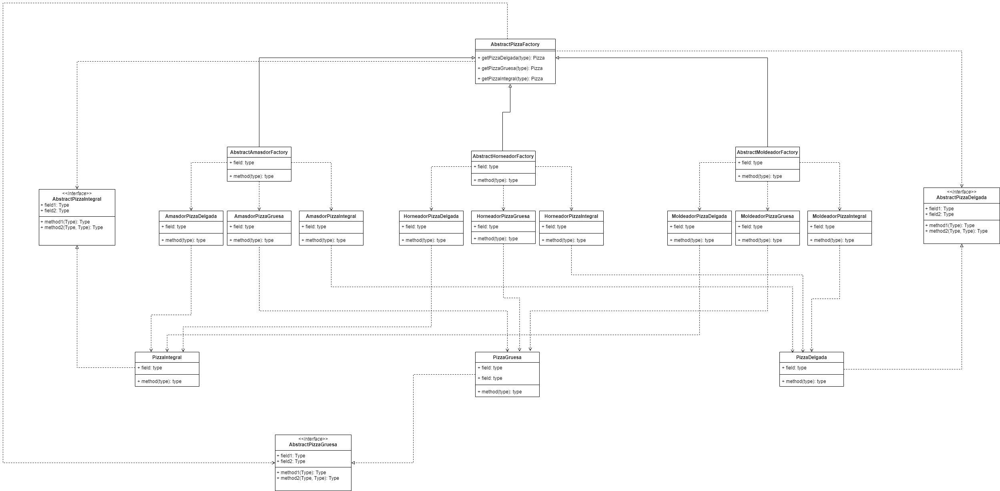

#### Parte I. 
El siguiente, es un modelo de clases de una aplicación que se comunica con un microcontrolador encargado de la fabricación automática de pizzas. Dichas clases encapsulan la lógica para amasar, hornear y moldear pizzas de las pizzas delgadas.


El programa principal del micro-controlador utiliza la siguiente función, la cual depende de las clases antes mostradas:

```Java
public void prepararPizza(Ingredientes[] ingredientes, Tamano tam) 
throws ExcepcionParametrosInvalidos{
	AmasadorPizzaDelgada am=new AmasadorPizzaDelgada();
	HorneadorPizzaDelgada hpd=new HorneadorPizzaDelgada();
	MoldeadorPizzaDelgada mp=new MoldeadorPizzaDelgada();
	am.amasar();
	if (tam == Tamano.PEQUENA){
		mp.moldearPizzaPequena();
	}
	else if(tam==Tamano.MEDIANA){
		mp.molderarPizzaMediana();
	}
	else{
		throw new ExcepcionParametrosInvalidos (“Tamano de piza invalido:”+tam);
	}
		aplicarIngredientes(ingredientes);
		hpd.hornear();
	}
	...
```

Se quiere actualizar el software, ya que el fabricante de las máquina va a sacar al mercado unas variantes de la máquina original, y quiere simplificar el proceso de adaptación del código de los microcontroladores. Por ahora se espera sacar dos variantes:

*	Máquina para preparar pizzas de masa gruesa (masa de pan).
*	Máquina para preparar pizzas de masa integral.

Es importante tener en cuenta que para dichas variantes, aunque la secuencia de pasos del proceso principal es el mismo, los procesos de amasado, moldeado y horneado son diferentes para cada variante.

Dado que es posible que en el futuro salgan variantes adicionales de esta máquina, y que se sabe que la secuencia de pasos en general NO cambiará, se le ha pedido que el software quede escrito de manera que la lógica básica no requiera cambios, independientemente de cómo se amase, como se hornee y cómo se moldee en dichas variantes.

1.	Teniendo esto en cuenta, y considerando el patrón de fábrica abstracta, plantee el modelo de clases que permitiría desacoplar la lógica de la fabricación de pizzas, de las diferentes manera como se pueden realizar las actividades de bajo nivel relacionadas (cocción, corte, etc.).

2.	Descargue el proyecto mediante el comando git (git clone) :
```
git clone https://github.com/CesarAVegaF312/DYAS-GoF-Patterns-Creational-PizzaFactory.git
```
	y ábralo en el IDE NetBeans.

3.	Revise el funcionamiento actual de la aplicación. Como este es un proyecto Maven, ejecútelo a través de la línea de comando (desde el directorio del proyecto):

```
mvn clean install
mvn exec:java -Dexec.mainClass="edu.unisabana.pizzafactory.consoleview.PreparadorPizza"
```

4.	Implemente el modelo propuesto. Para compilar después de haber hecho cambios, hágalo a través de Maven con: 

```
mvn compile
```

Nota: Si lo desea, puede revisar una [implementación de referencia del patrón Fábrica Abstracta](https://github.com/CesarAVegaF312/DYAS-GoF-FactoryMethod-ReferenceExample.git ), cuyo modelo corresponde al del siguiente diagrama 


MODELO PROPUESTO: 

